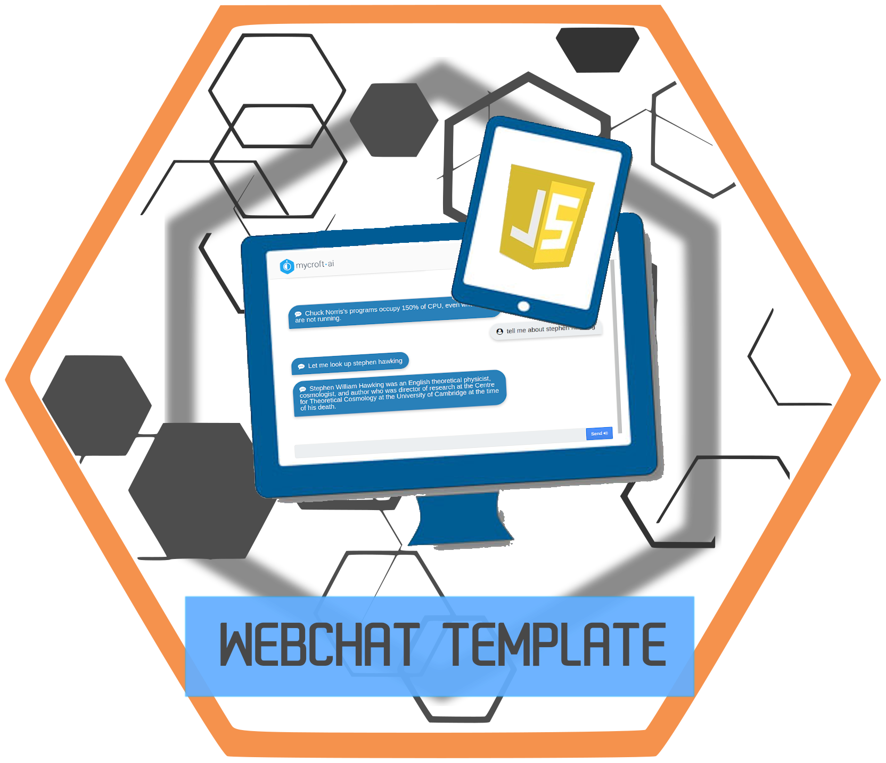
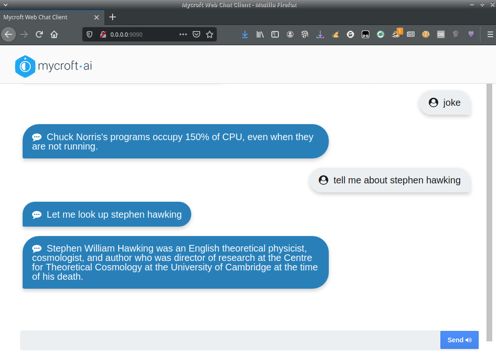

# HiveMind - Local WebChat



Mycroft Webchat Terminal - Connecting to the HiveMind with [javascript](https://github.com/JarbasHiveMind/HiveMind-js) reference implementation

This uses tornado to serve the webchat




## Usage

powered by [HiveMindJs](https://github.com/JarbasHiveMind/HiveMind-js)

```bash
usage: __main__.py [-h] [--port PORT] [--announce]

Start HiveMind WebChat

optional arguments:
  -h, --help   show this help message and exit
  --port PORT  port to run webchat (default 9090)
  --announce   announce HiveMind node in local network
```

Access from web browser `http://localhost:9090`

## Privacy

Securing tornado is out of scope for this repo, it is currently served by HTTP, you probably want to set up nginx or equivalent with [let's encrypt](https://letsencrypt.org/) certificates

Hivemind Encryption is supported

## Credits

Original Webchat UI: [jcasoft](https://github.com/jcasoft/external-services)


