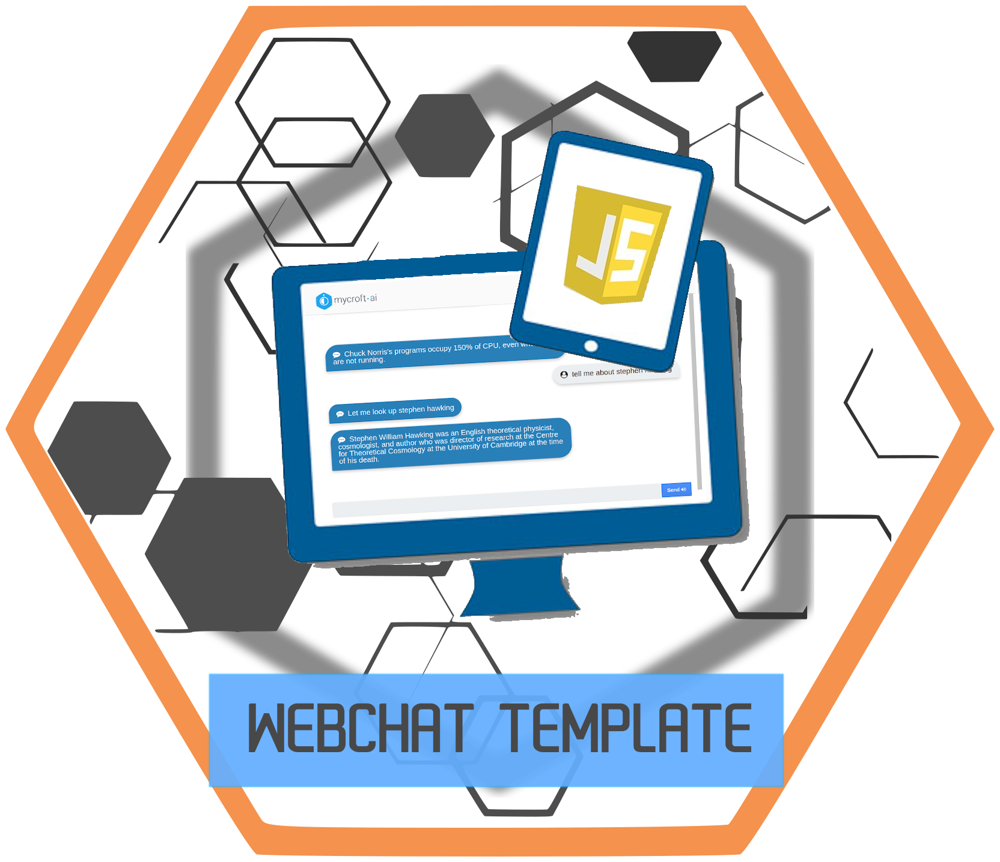
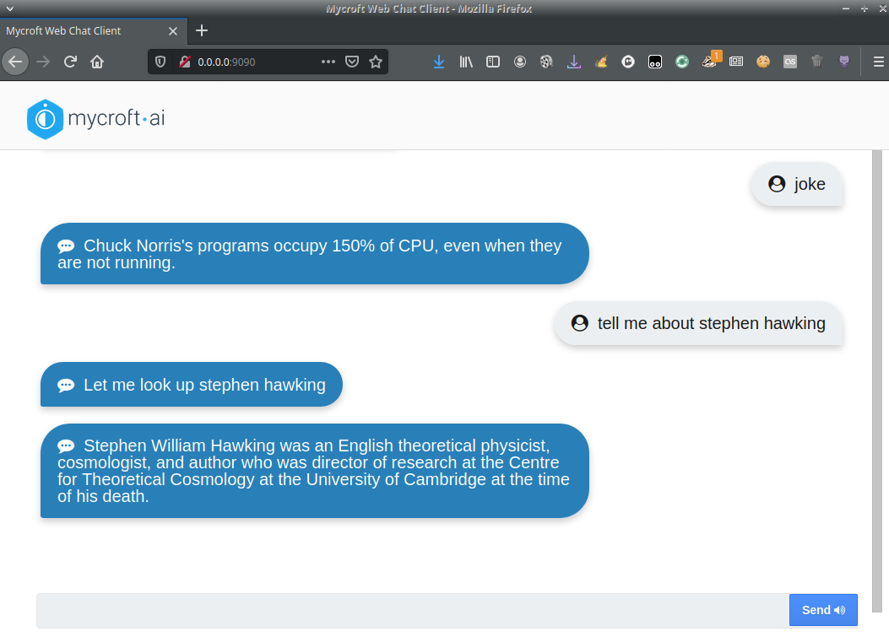

# HiveMind WebChat

> [!WARNING]
> HiveMind is pre-release software under active development. Expect bugs and
> breaking changes between releases.



A browser-based WebChat terminal for [HiveMind](https://github.com/JarbasHiveMind/HiveMind-core).
It serves a small chat page from a local web server; the page connects to a
hivemind-core instance as a satellite using the [HiveMind-js](https://github.com/JarbasHiveMind/HiveMind-js)
client, so you can talk to your voice assistant from any browser on the network.



## Where it sits

HiveMind is a mesh: satellite devices connect to a central
[hivemind-core](https://github.com/JarbasHiveMind/HiveMind-core) instance over an
authenticated, encrypted protocol. WebChat is one such satellite — a text
front end. The Python package here is only a static web server (Tornado); the
actual HiveMind connection runs in the browser via HiveMind-js. You point the
page at a running hivemind-core instance and enter the access key it issued you.

```
browser (this page + HiveMind-js)  ──websocket──►  hivemind-core  ──►  OVOS / agent
```

## Documentation

Full docs live under [`docs/`](docs/index.md): [getting started](docs/getting-started.md),
[configuration](docs/configuration.md), [architecture](docs/architecture.md)
(Python backend + JS frontend + the headless bridge), [deployment](docs/deployment.md),
[dependencies](docs/dependencies.md), [testing](docs/testing.md), and
[troubleshooting](docs/troubleshooting.md).

## Install

```bash
pip install hivemind-webchat
```

Or from source:

```bash
git clone https://github.com/JarbasHiveMind/HiveMind-webchat
cd HiveMind-webchat
pip install .
```

The HTTP server only needs `tornado`; `hivemind-bus-client` (2.x) and
`ovos-utils` are pulled in for the optional headless bridge. Dependency policy
lives entirely in `pyproject.toml` (no `requirements.txt` / `setup.py` /
`MANIFEST.in`); the bus-client 2.x stack resolves from prerelease **min-version
pins** with no `--pre`. See [docs/dependencies.md](docs/dependencies.md).

## Quickstart

### 1. Run hivemind-core and issue an access key

On the machine that will host the assistant, install and run
[hivemind-core](https://github.com/JarbasHiveMind/HiveMind-core), then add a
client for the webchat:

```bash
hivemind-core add-client
# note the printed access key and password/encryption key
hivemind-core listen --port 5678
```

### 2. Start the WebChat server

```bash
hivemind-webchat --port 9090
```

This serves the chat page at `http://localhost:9090`. The port here is the web
server's HTTP port, not the hivemind-core port.

### 3. Connect from the browser

Open `http://localhost:9090`, fill in the connection form, and click
**Connect to HiveMind**:

| Field | Value |
|-------|-------|
| Host / IP | hivemind-core's address (e.g. `127.0.0.1`) |
| Port | hivemind-core's HiveMind port (default `5678`) |
| Access Key | the key from `hivemind-core add-client` |
| Password | the shared password for that client |

Once the handshake completes, type a message and it is sent to hivemind-core as a
`recognizer_loop:utterance`; spoken replies are rendered back in the chat log.

The browser negotiates the highest HiveMind protocol version both peers support
(WIRE-1): against a **protocol v3** hivemind-core instance it runs the Noise handshake over the
default `Noise_XXpsk2_25519_ChaChaPoly_SHA256` suite — full cipher parity with
hivemind-core — and against older hivemind-core versions it falls back to the legacy **v1** password
handshake (PBKDF2-HMAC-SHA256 key derivation + AES-GCM). Either way, all traffic
after the handshake is encrypted end to end, entirely in the browser via
[HiveMind-js](https://github.com/JarbasHiveMind/HiveMind-js), which pairs native
Web Crypto with the pure-JS `@noble/ciphers` + `@noble/hashes` bundle for the two
primitives Web Crypto lacks (ChaCha20-Poly1305 and argon2id).

### Protocol v3 (Noise)

Against a v3 hivemind-core instance (hivemind-bus-client 0.10.1a1 / hivemind-core 4.7.0a1 or newer)
the browser negotiates the **default** ChaChaPoly suite and derives the PSK as
`argon2id(password, SHA-256(node_id))` **in-browser** — byte-for-byte identical to
hivemind-core. So the **Password** field alone is enough:

- **Password (default):** the client stretches it with argon2id on-device to the
  Noise PSK. No server-side KDF change and no provisioning required.
- **Provisioned PSK (optional):** paste a 64-hex-char PSK (equal to
  `argon2id(password, SHA-256(node_id))`) into the *Protocol v3* section of the
  connect dialog to skip on-device derivation. An optional **server key pin**
  enables KKpsk0 TOFU pinning.
- **PBKDF2 (fallback):** if a hivemind-core instance explicitly advertises the PBKDF2 PSK KDF, the
  client derives the PSK with PBKDF2 from the password instead.

The one caveat: a **minimal** page bundle shipped *without* the `@noble` primitives
degrades to the Web-Crypto-only AES-GCM (`25519_AESGCM_SHA256`) + PBKDF2 subset,
and then needs a provisioned PSK or a PBKDF2-advertising hivemind-core instance. If no PSK is
available for a v3 hivemind-core instance at all, the client warns and falls back to the legacy v1
handshake, so the UX keeps working against every hivemind-core instance.

## Command-line options

```
usage: hivemind-webchat [-h] [--port PORT]

Start HiveMind WebChat

options:
  -h, --help   show this help message and exit
  --port PORT  HTTP port to serve the webchat on (default 9090)
```

## How it works

- `hivemind_webchat.WebChat` is a `threading.Thread` wrapping a Tornado
  `HTTPServer`. It serves `templates/index.html` at `/` and the chat assets
  under `/static`.
- `index.html` loads the HiveMind-js client from jsDelivr and `app.js` wires
  the connection form to
  `JarbasHiveMind.connect(host, port, user, accessKey, password, options)`,
  where `options` carries the optional v3 provisioned PSK / server key pin.
- All HiveMind traffic (handshake, encryption, message routing) happens in
  the browser inside HiveMind-js — the Python side never touches hivemind-core.

## Tests

WebChat is a Python + JavaScript hybrid, so it has two test suites.

**Python** (`tests/`): `tests/test_smoke.py` covers the Tornado server + the
bridge construction; `tests/e2e/` boots a real loopback `hivemind-core` instance via
[hivescope](https://github.com/JarbasHiveMind/hivescope) and drives the **real**
`WebchatBridge` over a **real** `HiveMessageBusClient` — a chat message goes to
hivemind-core and a `speak` reply is routed back. Only the browser/websocket frontend
is mocked. No `importorskip`/`skipif`.

```bash
uv pip install -e ".[e2e]"
pytest tests/
```

**JavaScript** (`tests/e2e.mjs`): a Node end-to-end test that loads the exact
HiveMind-js client the page ships, connects to a real loopback hivemind-core instance
(`tests/hub_fixture.py`), performs the handshake, and verifies hivemind-core decrypts
and receives an encrypted utterance. A second test
(`tests/v3_negotiation.test.mjs`) drives the browser client's protocol-v3
negotiation path directly — feeding it a synthetic v3 ServerHello and asserting
it selects the AES-GCM Noise suite and derives a valid PSK from the password via
the PBKDF2 KDF. (The loopback hivemind-core floors an older stack predating the v3 suite,
so full v3-over-the-wire is not exercised end to end.)

```bash
npm install     # ws
npm run test:v3 # node --test tests/v3_negotiation.test.mjs  (no hivemind-core needed)
npm test        # v3 negotiation + node tests/e2e.mjs  (e2e needs python [e2e] stack)
```

Full details in [docs/testing.md](docs/testing.md).

## Security

The Tornado server is plain HTTP and out of scope for hardening here. For any
non-local exposure, put it behind a reverse proxy (nginx, Caddy) with TLS, for
example via [Let's Encrypt](https://letsencrypt.org/). The HiveMind connection
itself is always encrypted end to end between the browser and hivemind-core,
independent of how this page is served.

## Online demo

A static build is published from the `gh-pages` branch:
<https://jarbashivemind.github.io/HiveMind-webchat>. It is the same page served
by this server, pointed at whatever hivemind-core instance you enter.

## Credits

Original WebChat UI: [jcasoft](https://github.com/jcasoft/external-services).

## License

Apache 2.0 — see [LICENSE](./LICENSE).
